---
puppeteer:
  format: "A4"
  
  displayHeaderFooter: true
  headerTemplate: ' '
  footerTemplate: >
    <div style="font-size: 14px; width: 100%; text-align: center; padding: 0 1cm;">
      <span class="pageNumber"></span> / <span class="totalPages"></span>
    </div>
id: "test"
---

<!DOCTYPE html>
<html>
<head>
<meta charset="UTF-8">
<link rel="stylesheet" href="https://cdn.jsdelivr.net/npm/katex@0.16.9/dist/katex.min.css">
<script defer src="https://cdn.jsdelivr.net/npm/katex@0.16.9/dist/katex.min.js"></script>
<script defer src="https://cdn.jsdelivr.net/npm/katex@0.16.9/dist/contrib/auto-render.min.js"></script>
<script>
document.addEventListener("DOMContentLoaded", function() {
  renderMathInElement(document.body, {
    delimiters: [
      {left: "$$", right: "$$", display: true},
      {left: "$", right: "$", display: false}
    ],
    throwOnError: false
  });
});
</script>
</head>
<body>
</body>
</html>

<div class="cover-page">
  <div class="cover-main-title">
    Calculus
  </div>
  <div class="cover-subtitle">
    HW1:Expressing Function and Exploring Mathematical Models
  </div>
  <div class="cover-group">
    組別：第15組
  </div>
  <div class="cover-authors">
    組員：<br>
    411485018 蘇星丞<br>
    411485002 楊昕展<br>
    411485003 胡庭睿<br>
    411485042 黃柏崴
  </div>
</div>  


# Basic Concepts

## Q1
Is it true that $f = g$? Please explain why.

1. $f(x) = x + \sqrt{2-x}$ and $g(u)=u+\sqrt{2-u}$
2. $f(x) = \frac{x^2-x}{x-1}$ and $g(x)=x$

## Ans1

函數相等的定義是：在定義域的範圍內，相同的輸入值會得到相同的輸出值。

1. 他們兩個除了變數不同之外，其特徵皆符合定義內容，故可得f（x）=g（x）。
2. 雖然$f(x)$約分完和$g(x)$相同，但是他們兩個的定義域不同（$f(x)$的$x-1$不能$=0$，故可知$f(x)$不等於$g(x)$））  。

---

## Q2
The graphs of f and g are given.
<div style="text-align: center;">
  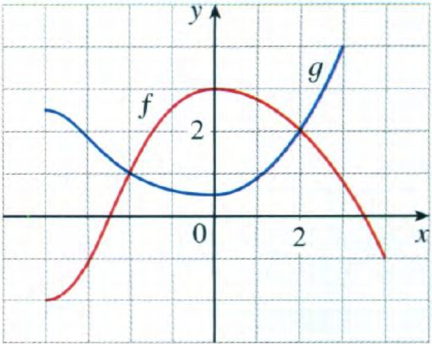
</div>

1. State the values of $f(-4)$ and $g(3)$.
2. Which is larger, $f(-3)$ or $g(-3)$?
3. For what values of $x$ is $f(x)$ = $g(x)$?
4. On what interval(s) is $f(x) ≤ g(x)$?
5. State the solution(s) of the equation $f(x) = —1$.
6. On what interval(s) is $g$ decreasing?
7. State the domain and range of $f$.
8. State the domain and range of $g$.
## Ans2
1. $f(-4) = -2, g(3) = 3$
2. $g(-3)$
3. $x = 2, -2$
4. $[2,\infty), (\infty, -2]$
5. $x=4 or-3$
6. $[-4,0]$
7. $Domain:[-4,4]$
    $Range:[-2,3]$
8. $Domain:[-4,3]$
    $Range:[0.5,4]$
---

## Q3
Determine whether the equation, table, or graph defines $y$ as a function of $x$.
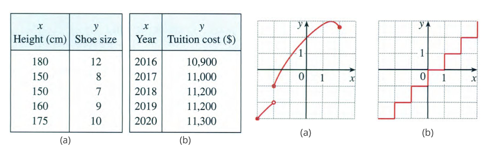
1. $3x^2-2y=5$
2. $x^2+(y-3)^2=5$
## Ans3
* 方程式$1$:$y$是$x$的函式
* 方程式$2$:$y$不是$x$的函式
* 表格(a):$y$不是$x$的函式
* 表格(b):$y$是$x$的函式
* 圖(a):$y$是$x$的函式
* 圖(b):$y$不是$x$的函式


---

## Q4
Classify each function as a power function, root function, polynomial (state its degree), rational function, algebraic function, trigonometric function, exponential function, or logarithmic function. Explain why.
1. $f(x) = x^3+3x^2$
2. $r(t) = t^{\sqrt{3}}$
3. $v(t) = 8^{t}$  
4. $g(u) = \log_{10}u$
5. $f(t) = \frac{3t^2 + 2}{t}$  
6. $y = \frac{1}{x^2}$  
7. $y = \frac{x}{x^2+1}$  
8. $g(t) = \cos (t)^2 -\sin (t)$

## Ans4
1. 
    * polynomial, $x$的最高次項為$3$，故$degf(x)= 3$
    * algebraic, 從多項式由代數方法組合而成
    * rational, 可以說他的分母為1，但沒甚麼意義
2. 
    * transcendent, $x^a$，$a$為常數，以變數為底，但指數為無理數，不屬於代數函數的任何一種，故為超越函數
    * power, $x^a$, $a$為常數(無理數也算常數)
3. 
    * exponential, $x^a$，$a$為常數，常數為底，變數為指數項，故為指數函數
4. 
    * logarithmic, 他是一個底數為10的方程式，並且u不能為O與負數，故為一種變數函數
5. 
    * rational, 兩個多項式相除(P(x)/Q(x）, P、Q為多項式)
    * algebraic, 從多項式由代數方法組合而成
6. 
    * rational, 為兩個多項式相除 
    * power, 如果把$\frac{1}{x^2} = x ^{-2}$，依定義$x^a$, $a$為常數(-2為常數)
    * algebraic function, 從多項式由代數方法(除法)組合而成
7. 
    * rational,兩個多項式相除
    * algebraic, 從多項式由代數方法組合而成
8. 
    * trigonometric, combined of two trig functions

---

## Q5
Match each equation with its graph. Explain your choices. (Do not explain by comparing through direct drawing of graphs using a computer or manually.)

## Ans5

1. 
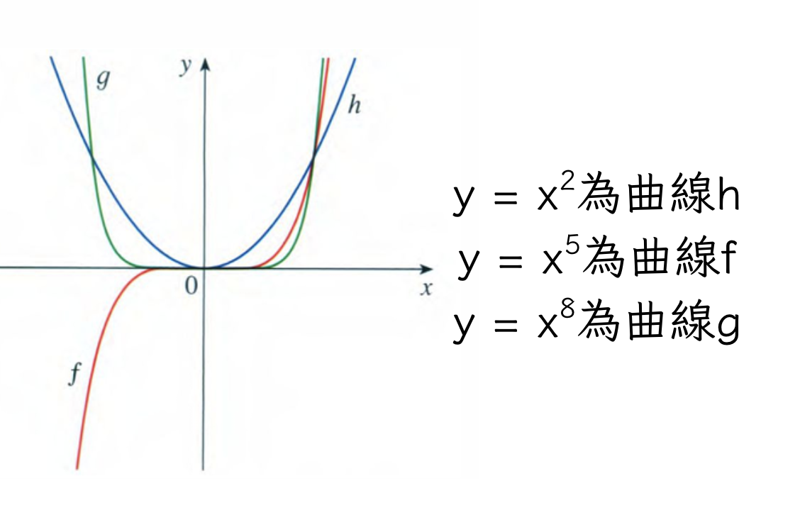

先由偶函數及奇函數的定義分析。設多項式 $f(x) = x^n$（$n$ 為正整數），則當 $f(-x) = f(x)$ 時為偶函數，其座標平面圖形對稱於 $y$ 軸（呈拋物線狀）；而當 $f(-x) = -f(x)$ 時則為奇函數，其座標平面上的圖形（除原點外）對稱於原點。

假設 $n$ 為偶數時（除 $0$ 之外），$(-x)^n = x^n$，故 $f(x)$ 為偶函數；假設 $n$ 為奇數時，$(-x)^n = -x^n$（即 $-(-x)^n = x^n$），故 $f(x)$ 為奇函數。再來，當 $n$ 越大時，在 $0 < x < 1$ 的範圍內，$x^n$ 的值會越小（因為小於 $1$ 的數相乘越多會越小）；當 $x = 1$ 時會相等（$f(1) = 1$）；而當 $x > 1$ 時，$n$ 值較大者其 $f(x)$ 的值也會較大。

回到圖形與方程式的對應：圖形中只有一個曲線對稱於原點，且在 $2, 5, 8$ 三個指數中只有 $5$ 為奇數，故 $y = x^5$ 為曲線 $f$。而 $2$ 與 $8$ 為偶數，即圖形對稱於 $y$ 軸（呈拋物線狀）；由 $8 > 2$ 可知，當 $x$ 於 $(0, 1)$ 之間時，$y = x^8$ 的值較小；當 $x = 1$ 時兩者相等。故 $y = x^2$ 為曲線 $g$，而 $y = x^8$ 為拋物線 $h$。（也可以經由過交點後，上升幅度較高者為 $y = x^8$ 來判斷）。

2. 
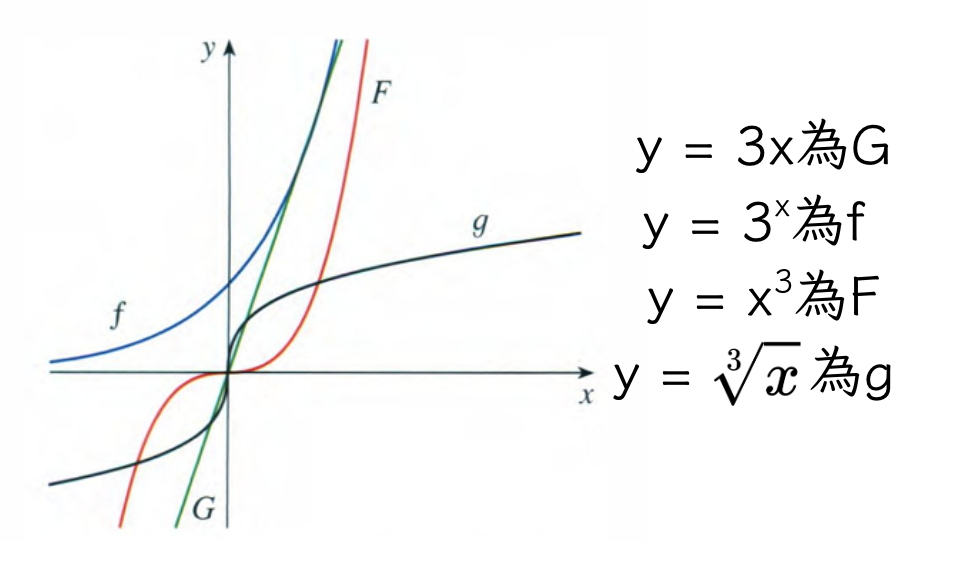

$y = 3x$ 為線性函數 (linear function)，只有 $G$ 為直線，故 $y = 3x$ 為 $G$。

$y = 3^x$ 為指數函數 (exponential function)，值域 $(0, \infty)$，即唯有曲線 $f$ 符合 $y = 3^x$。

比較 $y = x^3$ 與 $y = \sqrt[3]{x}$，前者為多項式函數 (polynomial)，後者為根號函數 (root function)。差別是隨 $x$ 上升時，前者圖形會先平 (flatter) 再陡 (steeper)，後者反之，可知 $y = x^3$ 為 $F$，而 $y = \sqrt[3]{x}$ 為剩下的曲線。

---

## Q6
What do all members of the family of linear functions $f(x) = 1 + m(x + 3)$ have in common Sketch several members of the family.
## Ans6
假設 $x = -3$，能發現無論 $m$ 值為多少，代入 $f(-3) = 1 + m(-3 + 3) = 1 + m \cdot 0 = 1 + 0 = 1$。用視覺化 (Visually) 方式，可得知在 $xy$ 座標平面中，圖形皆會交於 $(-3, 1)$ 這點上。意思是隨 $m$ 變動，圖形皆會以一條無限長的直線 (linear)，並以 $(-3, 1)$ 為中心旋轉（類似時鐘中心，但並不包括垂直線）。而且，當 $|m|$ 非常大時，圖形在巨觀（正常尺度）觀察下會非常類似鉛直線，這是肉眼分辨不出的。
<div style="display: flex; justify-content: center; gap: 20px; margin-top: 10px;">
  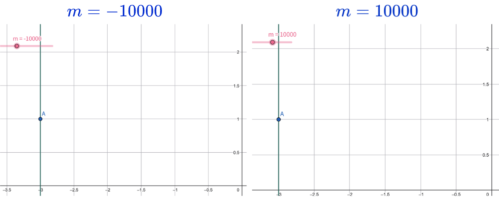
</div>
<div style="display: flex; justify-content: center; gap: 20px; margin-top: 10px;">
  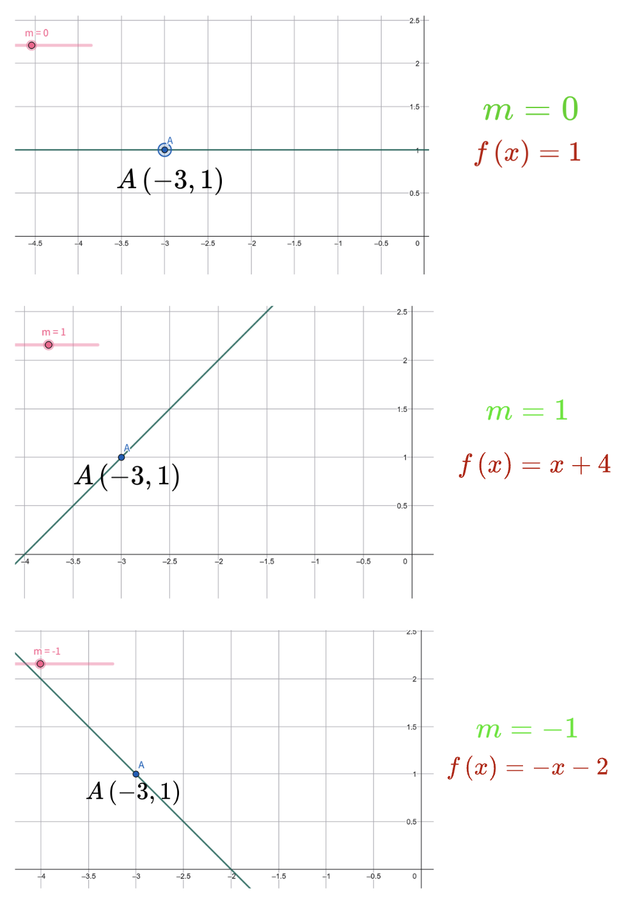
</div>


---

## Q7
Sketch several members of the family of polynomials $P(x) = x^3 - cx^2$. How does the graph change when $c$ changes?
## Ans7
<div style="display: flex; flex-wrap: wrap; justify-content: center; gap: 10px; margin-top: 10px;">
  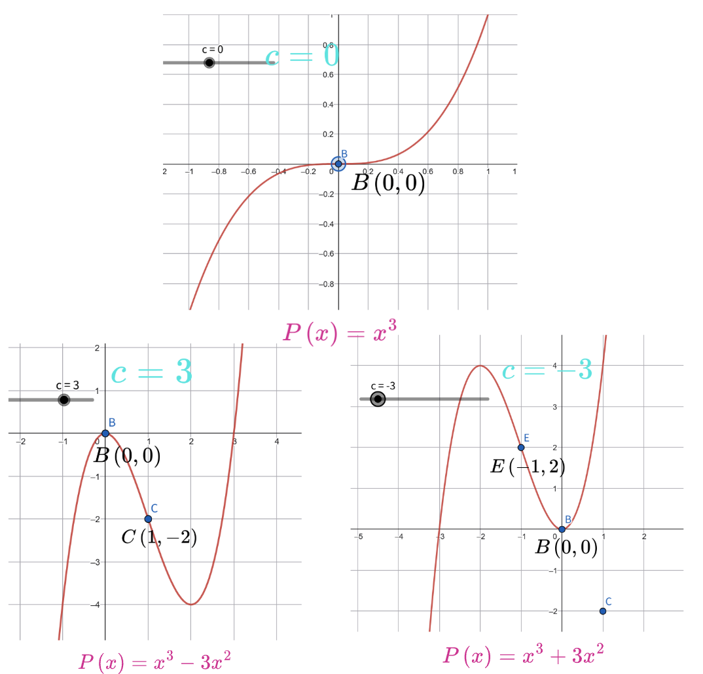
  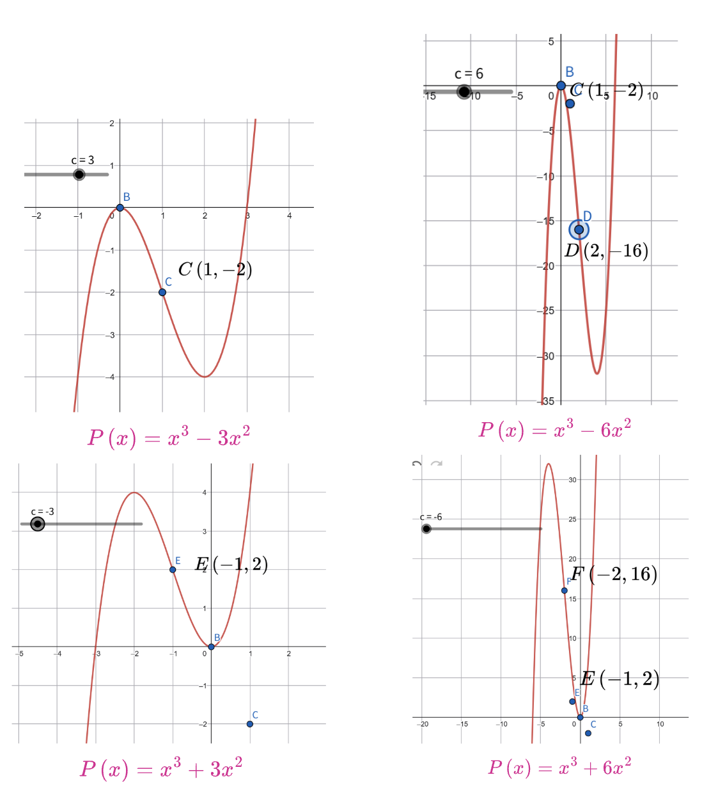
  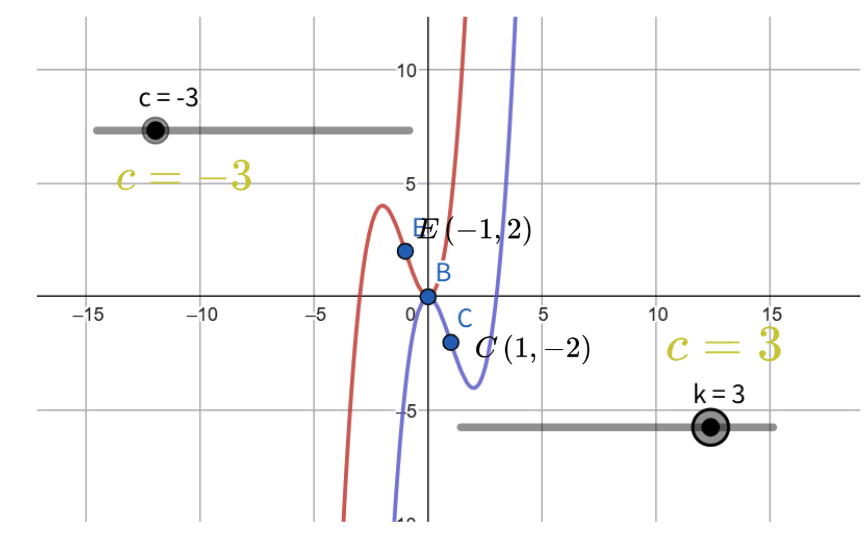
</div>

先以 $c = 0$ 觀察 $xy$ 座標平面圖形，會發現是以中心 $(0, 0)$ 為主，右邊先以一條有如水平的線緩慢上升，$x$ 值越大上升速度越快，左邊的方向反之。隨著 $c$ 值增加（$c > 0$），圖形中心（對稱點）從 $(0, 0)$ 往右下（尤其是向下方）快速移動，開始出現以中心右凹左凸（有點像打勾與打勾旋轉 $180^\circ$），且凹凸越來越明顯；隨著 $c$ 值減少（$c < 0$），圖形中心從 $(0, 0)$ 往左上移動，同樣出現以中心右凹左凸，凹凸也越來越明顯。

我們還發現無論 $c$ 為何值，圖形與 $x$ 軸的交點都是 $(0, 0)$ 與 $(c, 0)$ 兩點，隨 $c$ 值絕對值增加，圖形上這兩點的距離也之增加。此外，當 $c$ 互為相反數時（除 $c = 0$ 外），會發現其圖形對稱於 $(0, 0)$，甚至每一點都對稱於 $(0, 0)$。可推論當 $c$ 為某值（假設為 $k$，$k \neq 0$）時，若在該圖形上取一點 $(x, f(x))$，則當 $c = -k$ 時，其圖形會經過 $(-x, -f(x))$。


---

## Q8
Draw a **single** mind map to illustrate the relation between mentioned mathematical models (linear, polynomials, power, rational, algebraic, trigonometric, exponential, logarithmic)

## Ans8
<div style="text-align: center; margin-top: 10px;">
  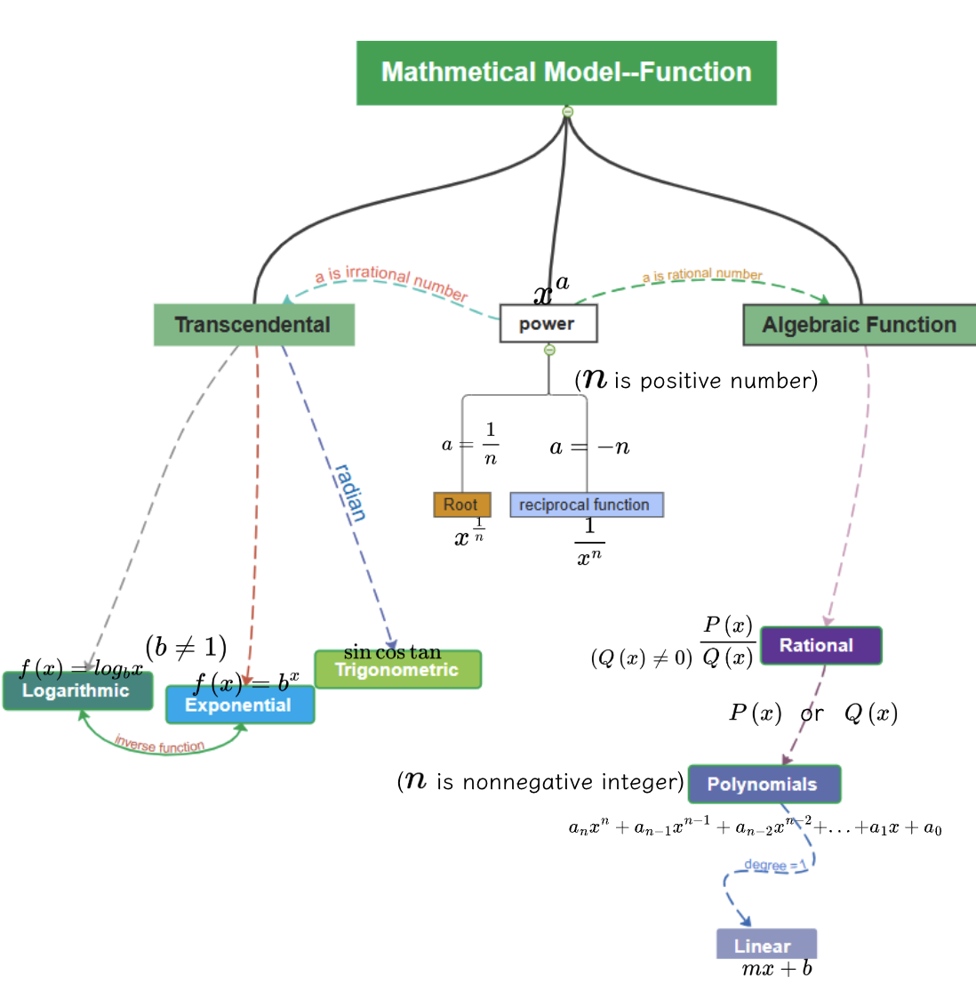
</div>


# Alternative expression for functions

## Q1
You place a frozen pie in an oven and bake it for an hour. Then you take it out and let it cool. Describe how the temperature of the pie changes as time passes. Then sketch a rough graph of the temperature of the pie as a function of time.
## Ans1
1. 剛一開始從冷凍狀態開始加熱時，因為溫差較大，一接觸熱會快速上升至與烤箱一樣溫度(與室溫相比)，然後幾乎不變到拿出接觸較低室溫而開始下降，而注意的是，因為室溫大於冷凍時的溫度，所以在下降到與室溫差不多時，會比一開始放進烤箱時還高。

2. 
<div style="text-align: center; margin-top: 10px;">
  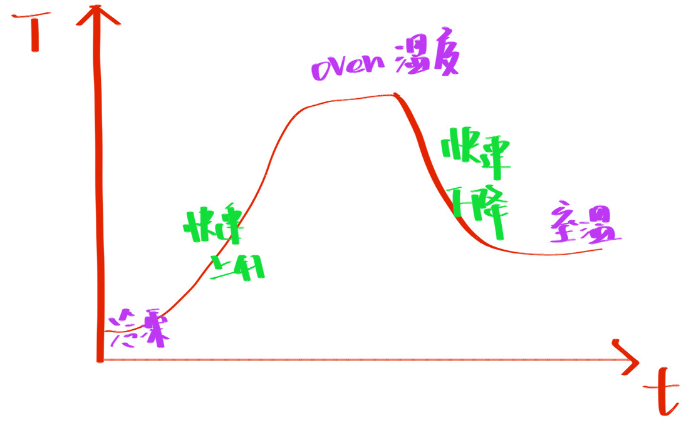
</div>

---

## Q2
Three runners compete in a 100-meter race. The graph depicts the distance run as a function of time for each runner.
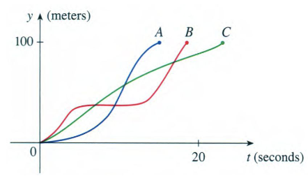
1. Describe in words what the graph tells you about this race.
2. Who won the race? Did each runner finish the race?
3. What are the ranges of the three functions?
## Ans2
1. 根據題意，三位跑者中，$A$ 跑者的初始速度是三者最慢，但其在 $11\text{ s}$ 處超越 $B$、$C$ 跑者，並且是最快完成比賽的選手。而 $B$ 跑者雖然初始速度最快，但在 $5\text{ s} \sim 13\text{ s}$ 的移動距離幾乎為 $0$，直到在 $13\text{ s}$ 處跑速大幅提升，最後是第二個完成比賽。$C$ 跑者雖然速度是最平穩的，但卻是最後一個完成比賽。

2. $A$ 最快到達終點，贏得了比賽。但根據圖示，每位選手最終都完成了比賽。

3. Ranges:
    - $A: [0, 100]$
    - $B: [0, 100]$
    - $C: [0, 100]$

---

## Q3
Researchers measured the blood alcohol concentration (BAC) of eight adult male subjects after rapid consumption of 30 mL of ethanol (corresponding to two standard alcoholic drinks). The table shows the data they obtained by averaging the BAC (in g/dL) of the eight men.
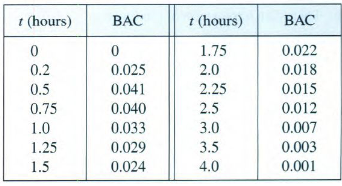

## Ans3
1. 
<div style="text-align: center; margin-top: 10px;">
  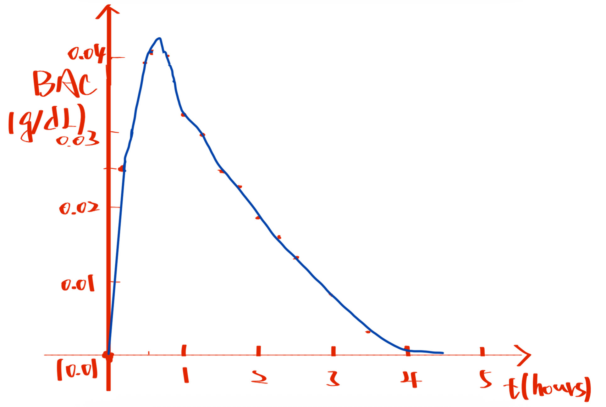
</div>

2. 根據上表與上述內容，我們可以繪製出對應圖形。觀測結果顯示，成人在攝入 $30\text{ mL}$ 的乙醇後，八位男性身體平均的 BAC ($\text{g/dL}$) 會有明顯且快速的上升。最高值的位置介於 $t$ 為 $0.5 \sim 0.75$ 之間；而後約在 $t = 0.75$ 處開始隨著時間降低，直到 $t = 4.0$ 時趨近於 $0$。


---

## Q4
Express the function $h(x) = \sqrt{4-x^2}$
## Ans4
1. 由於 $h(x)$ 為根號函數 (root function)，其根號內的 $4 - x^2$ 必須不小於 $0$，故：
   $$4 - x^2 \ge 0 \implies x^2 \le 4 \implies -2 \le x \le 2$$
   即定義域 (Domain) 為 $[-2, 2]$。根據 $4 - x^2$ 的性質，$h(x)$ 的最大值發生在 $x = 0$ 時，為 $\sqrt{4} = 2$，故值域 (Range) 為 $[0, 2]$。

2. 
<div style="text-align: center; margin-top: 10px;">
  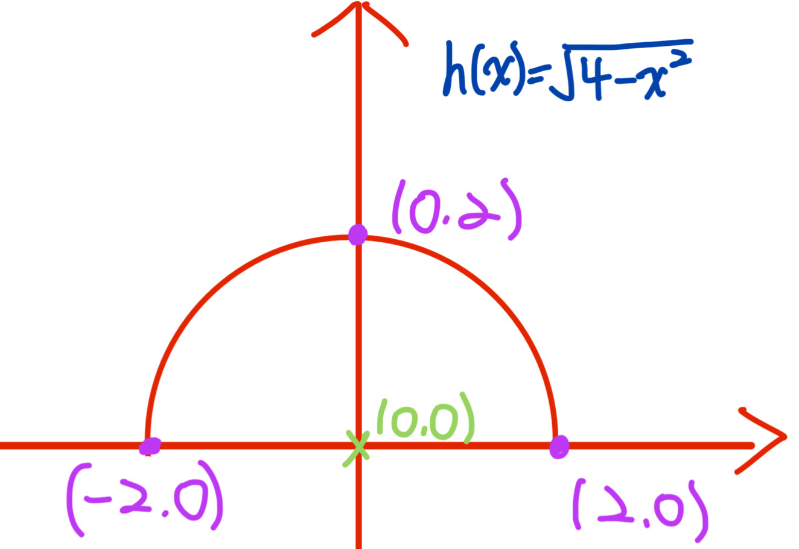
</div>

3. 從圖形中我們可以發現，$h(x)$ 的圖形是一個上半圓，且圓心位於 $(0, 0)$；此外，最高點為 $(0, 2)$，最低點則位於 $(-2, 0)$ 與 $(2, 0)$ 兩點。另外可以發現其性質：圖形以 $y$ 軸為對稱軸，呈現左右對稱。

## Q5
A Norman window has the shape of a rectangle surmounted by a semicircle. If the erimeter of the window is 10 m, express the area A of the window as a function of the width x of the window.
## Ans5
1. 設矩形部分的高為 $h$，窗戶寬度為 $x$（其半圓半徑則為 $\frac{x}{2}$）。
   窗戶的周長為：
   $$2h + x + \frac{1}{2}(\pi x) = 10$$
   由此可解得 $h$：
   $$h = \frac{1}{2}\left(10 - x - \frac{\pi x}{2}\right) = 5 - \frac{1}{2}x - \frac{\pi x}{4}$$
   窗戶的總面積 $A$ 為矩形面積加上半圓面積：
   $$A = xh + \frac{1}{2} \cdot \pi \left(\frac{x}{2}\right)^2 = xh + \frac{\pi x^2}{8}$$
   將 $h$ 代入 $A$ 得：
   $$A = x \cdot \left(5 - \frac{1}{2}x - \frac{\pi x}{4}\right) + \frac{\pi x^2}{8}$$
   $$A = 5x - \frac{1}{2}x^2 - \frac{\pi x^2}{4} + \frac{\pi x^2}{8} = 5x - \frac{1}{2}x^2 - \frac{\pi x^2}{8}$$
   $$A(x) = 5x - \left(\frac{4 + \pi}{8}\right)x^2$$

2. 
| $x$ | $A$ |
| :---: | :---: |
| 0 | 0 |
| 0.5 | $\approx 2.28$ |
| 1.0 | $\approx 4.11$ |
| 2.0 | $\approx 6.43$ |
| 2.8 | $\approx 7.00$ |
| 3.0 | $\approx 6.96$ |
| 3.5 | $\approx 6.56$ |
| 4.0 | $\approx 5.71$ |
| 4.5 | $\approx 4.42$ |
| 5.0 | $\approx 2.68$ |
| 5.5 | $\approx 0.49$ |
| 6.0 | $\approx -2.15$ |
3. 
<div style="text-align: center; margin-top: 10px;">
  
</div>

4. 先從1.所得的A公式判斷，A(x)為一個開口向下的拋物線(二次項係數為負)，故會有個最高值，而從圖中也可證明此結果，表格顯示隨著x從0增加到2公尺，面積A快速上升。數值在 x\approx2.8公尺時，面積A達到最高7.0平方公尺。過了這個點後，面積A數值反而開始下降，甚至當x為6.0公尺時，面積A呈現負數，意思為圖形不成立。連結題目，周長固定時，在x從0開始變大，剛開始會呈現窄長的窗戶，而上半圓也會非常小，到x為2.8時，上半圓與長方形加起來的面積為最大，然而隨著x在增加，雖然上半圓會越來越大，但由於周長固定，長方形會越來矮，從寬矮窗戶到最終可能只剩半圓窗戶。
## Q6
Describe the differences in understanding a function from different forms of expression (ftable, description, formula, and graph).

## Ans6

| 表達方式 | 特點與描述 |
| :--- | :--- |
| **Table** (表格) | 在一個表內可以完整且集中地看到所有數據，我們可以簡單對照其之間的差異。 |
| **Description** (口語描述) | 他是更加**口語**的方法，也是日常最常使用的，雖然沒有明確的數據，但我們可以**直接了解事件本身**。 |
| **Formula** (算式) | 他可以利用數據之間的關聯找出**通式**，並且也可以利用他推算出更大量的數據，製成表格。 |
| **Graph** (圖形) | 他是一種**將數據顯示在座標平面上**的方法，藉此可以**更直觀**地找到數據之間的關聯。 |

我認為 Description (口語描述) 雖然是最為直覺的方式，但若要將其轉換成其他表達方式其實較為困難，通常需要搭配其他方式並行。另一個挑戰在於如何詳細地描述或解釋過程，這非常考驗我們對問題的觀察力與理解程度；例如在第二部分的 Q2 中，我們必須深入理解 $x, y$ 軸所對應的關係、分析名次差異的背後原因等，才能順利作答。

此外，第二部分 Q6 的 Table (表格) 創作也是一個困難點。由於我們從小到大的數學教育大多直接給予 Formula (算式) 來解題，因此在進行角色互換、需要自行建立數據關聯時會感到不知所措。但參考教授評分標準中提及的 "Level of importance of the data in the table" 後，我才發現表格能更有效地輔助我們找到所求的關鍵數據，甚至是作為圖形繪製後的延伸。

相對而言，若有圖形供判斷，Graph (圖表) 是較為容易理解的方式。然而，作圖本身卻最耗費時間，且稍有不慎便容易出錯；此外，圖表也存在許多不確定性（如第二部分 Q1 的烤箱問題），僅憑 Description 很難準確掌握溫度的真實變化曲線，往往只能依賴常識判斷。因此，在作圖時若能同時結合 Formula、Description 與 Table 的資訊，其準確度將會大幅度提升。

---

# Mathematical model for physics

## Q1
How to install python, numpy, matplotlib in your computer?

## Ans1

### Steps
1. 開啟瀏覽器到https://www.python.org/，或直接搜尋python並點入第一個網址
2. 點擊後，往下滑，會看到”Download the latest version of Python”的下方有黃色大框寫”Download Python 3.13.7”(查詢時間不同，版本可能有些許差異)，點擊進入下載網頁。
<div style="text-align: center; margin: 10px 0;">
  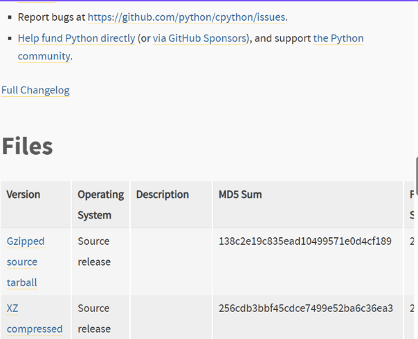
</div>

3. 下載完點擊下載檔案，非常要注意的是要先點Add python.exe to PATH(不然只能去用編譯器，因為電腦無法知道有下載python，只能自行去環境變數中加路徑)，接著就按Install Now(Customize installation也可，先按next，要記住按Add Python to environment variables，然後可自己選下載位置，方便以後查找)，等出現Setup was successful，按close關閉。
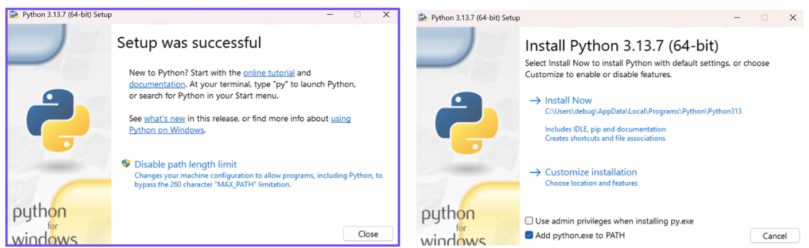

4. 確認電腦裡有python(安裝好不一定能用)
方法:點擊首頁左下角開始圖示，查詢cmd，點擊Command Prompt，出現黑色大框框，鍵盤打python --version，按Enter，出現python 3.13.7即代表成功。
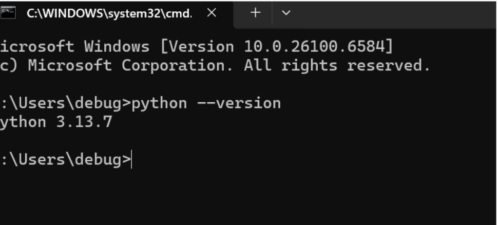
    出現Python was not found(或其他否定句)，建議先解除安裝(重新點下載資料，按Uninstall，Uninstall成功後，重新安裝一遍)。
    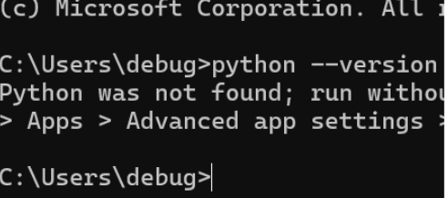

5. 安裝編譯器(以vscode為例):
    到https://code.visualstudio.com/Download 頁面中下載對應自己作業系統的版本，下載時需記得將vscode加入系統環境變數中。
    <div style="text-align: center; margin: 10px 0;">
      
    </div>
6. 安裝完成後開啟vscode並到側邊欄點擊延伸模組，安裝圖中的vscode python extensions
    <div style="text-align: center; margin: 10px 0;">
      
    </div>
7. 到左上角檔案中找到開啟資料夾選項，開啟先前下載的作業範例檔案
    <div style="text-align: center; margin: 10px 0;">
      
    </div>
8. 按下ctrl+shift+p(Windows),cmd+shift+p(MacOS)，找到create new terminal (with profile)，便可以開啟終端機
    .png)
9. 在終端機輸入pip install numpy和pip install matplotlib便可以成功安裝這次作業所需要的套件
    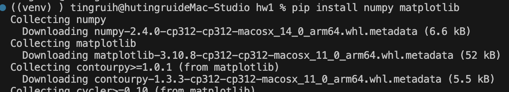
### Challenges, issues and solutions

1. python安裝
    Q1:不知下載哪個版本(32或64bits)
    Sol1:因為查網路都只出現用cmd查python --version的部分，最終我請教了AI，最終在About裡的system type看到了。
    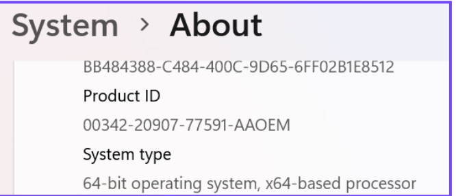
    Q2: 為什麼要勾選 "Add python.exe to PATH"？
    Sol2: 在爬文以及詢問 AI 後發現，勾選此選項會將 Python 的安裝目錄自動加入作業系統的「環境變數」(PATH) 中。這能讓系統在任何資料夾路徑下，都能透過終端機（如 CMD）直接辨識並執行 `python` 與 `pip` 指令。若未勾選，系統會因找不到檔案路徑而報錯，導致無法直接安裝套件（如 numpy）或執行程式，屆時必須手動進入系統設定添加，過程較為繁瑣。
     * 多問了如果將64 bit system裝上32 bit python會發生什麼事情 
     <div style="text-align: center; margin: 10px 0;">
       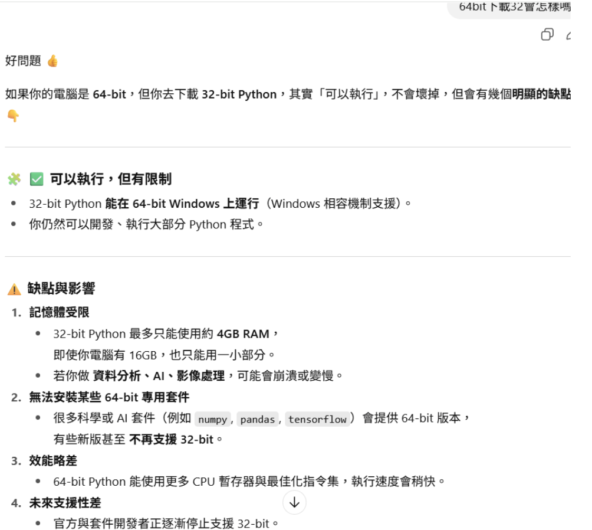
     </div>
2. matplotlib 和 numpy 安裝
    Q1:其實沒有明顯的困難(依照指示就好)不過還是有些疑問是他們兩個是什麼?為何要安裝?
    Sol1:numpy是運算套件，使python有陣列等功能處理大量數據。matplotlib可使數據視覺化(Visually)，做折線圖、長條圖、圓餅圖、散點圖(教授範例)。
    * 查詢過程(資料來源：https://ithelp.ithome.com.tw/articles/10381595, https://ithelp.ithome.com.tw/m/articles/10321770)
    <div style="text-align: center; margin: 10px 0;">
      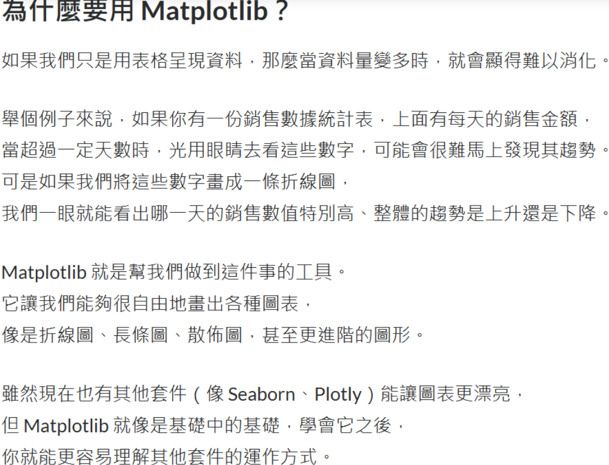
      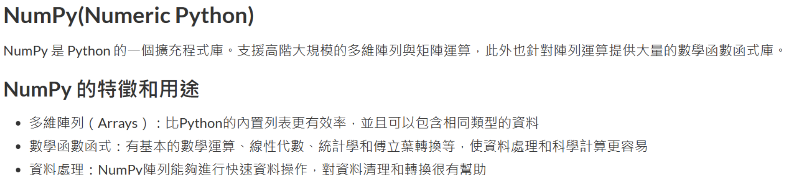
    </div>

### Q1補充
在做了一些功課後，因為每位組員的電腦環境都不相同，所以我決定採用建立venv的方案，寫好requirements.txt並放到github上，讓reviewers在檢查時更方便，以下為使用步驟。
<div style="text-align: center; margin: 10px 0;">
  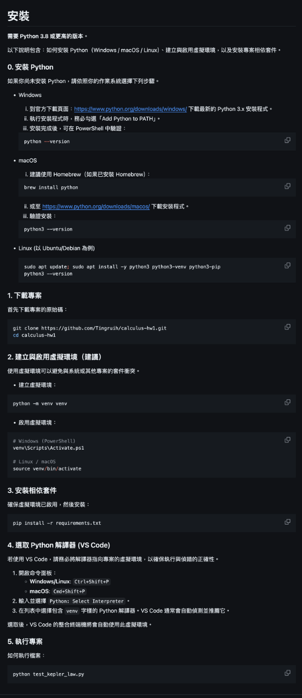
</div>


## Q2
The table shows the mean (average) distances d of the planets from the sun (taking the unit of measurement to be the distance from the earth to the sun) and their periods T (time of revolution in years).
<div style="text-align: center; margin: 10px 0;">
      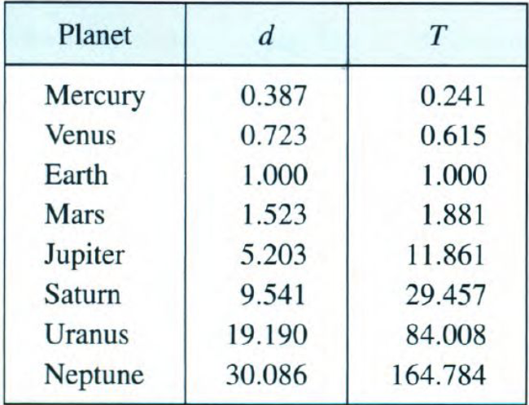
    </div>


## Ans2

```python
import numpy as np
import matplotlib.pyplot as plt
from kepler law import *
```
* matplotlib這個模組引入並把它命名為plt，因為本來的名字太長了
* 引入kepler_law.py使用的模組以及定義過的函式，like period_vs_distance_fit
```python
def main():
    planets = ["Mercury", "Venus", "Earth", "Mars", "Jupiter", "Saturn", "Uranus", "Neptune"]
    distances = np.array([0.387, 0.723, 1.000, 1.523, 5.203, 9.541, 19.190, 30.086])  
    periods = np.array([0.241, 0.615, 1.000, 1.881, 11.861, 29.457, 84.008, 164.784]) 
```
* 根據投影片的數據透過numpy建立陣列以方便進行計算。

```python
a, b = period_vs_distance_fit(distances, periods)
    print(f"Fitted power model: T = {a:.4f} * d^{b:.4f}")

    draw_period_vs_distance(distances, periods, a, b)
    print("Plot saved as 'period_vs_distance.png'")

    mse = calculate_model_mse(distances, periods, a, b)
    print(f"Mean Squared Error (MSE): {mse:.6f}")

    print("\n--- Kepler's Law Test (comparing each planet to Earth) ---")
    earth_idx = planets.index("Earth")
    
    for i, planet in enumerate(planets):
        if i == earth_idx:
            continue
        
        diff = kepler_law_test(
            period1=periods[earth_idx],
            distance1=distances[earth_idx],
            period2=periods[i],
            distance2=distances[i]
        )
        print(f"Difference between Earth and {planet:<8}: {diff:.6f}")
```
### Results:
```txt
Fitted power model: T = 1.0004 * d^1.4995
Plot saved as 'period_vs_distance.png'
Mean Squared Error (MSE): 0.000347

--- Kepler's Law Test (comparing each planet to Earth) ---
Difference between Earth and Mercury : 0.002077
Difference between Earth and Venus   : 0.000772
Difference between Earth and Mars    : 0.001562
Difference between Earth and Jupiter : 0.001194
Difference between Earth and Saturn  : 0.000931
Difference between Earth and Uranus  : 0.001343
Difference between Earth and Neptune : 0.002905
```
* **驗證冪函數模型的有效性**：程式擬合得到的指數 $b \approx 1.4995$ 與克卜勒第三定律理論值 $1.5$ ($T^2 \propto d^3 \Rightarrow T \propto d^{1.5}$) 的相對誤差僅約 $0.03\%$，這不僅驗證了物理定律，也證明了我們選用冪函數模型 (Power Model) 來擬合行星數據是極具合理性的。
* **高精度的擬合結果**：均方誤差 (MSE) 僅為 $0.000347$，極低的數值顯示擬合曲線幾乎完美貼合實際觀測數據，展現了實驗數據的高品質與模型的高準確度。

```python
def draw_period_vs_distance(distances, periods, a, b):
    # Draw original data and fitted power function curve, save as image file
    # Scatter plot of original data
    plt.scatter(distances, periods, color='blue', label='Observed Data')

    # Generate smooth curve using fitted model
    d_range = np.linspace(min(distances), max(distances), 100)
    T_fit = a * d_range**b

    # Plot fitted curve
    plt.plot(d_range, T_fit, color='red', label=f'Fitted Model: T = {a:.2f} * d^{b:.2f}')
    plt.xlabel('Distance (AU)')
    plt.ylabel('Period (years)')
    plt.title('Period vs. Distance')
    plt.legend()
    plt.grid(True)

    # Save the plot to a file instead of showing it
    plt.savefig("period_vs_distance.png", dpi=300, bbox_inches='tight')
    plt.close()  # Close the figure to free memory
```
### Results
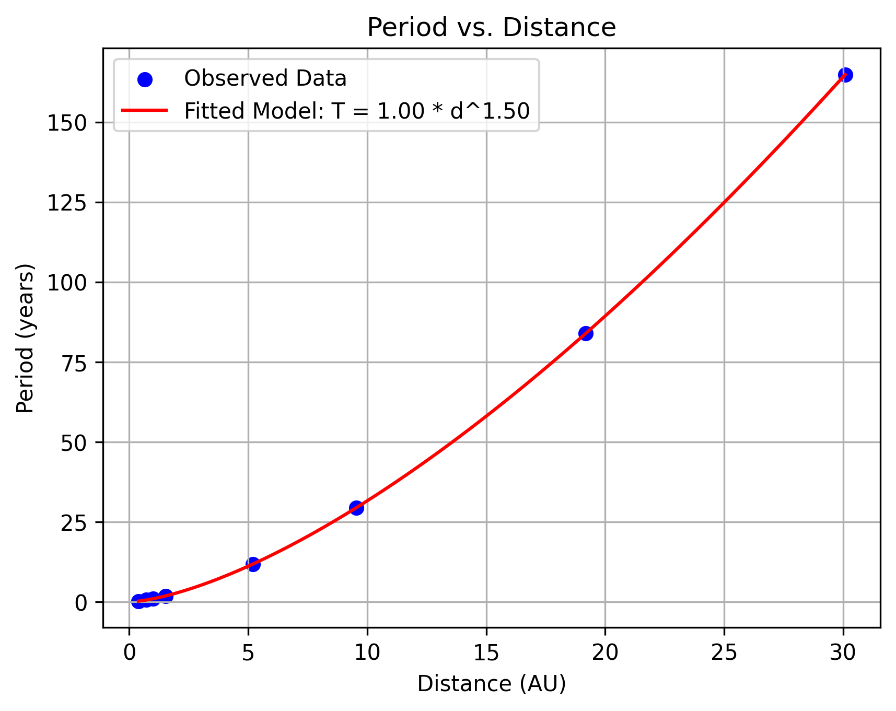

### Explain
* `plt.scatter()`:
  繪製散點圖的函式，將x軸設為distances，y軸設為periods，每個點的顏色設為藍色，並將這些散點的標籤名稱命名為observerd data

* `d_range = ...`:
    在行星距離太陽的最短與最長距離間均勻生成100個點，回傳一個有100個數值的陣列
* `T_fit =...`:
    將模型套用到剛剛的100個距離點上，得到一個100個預測週期的陣列
* `plt.plot()`:
    使用剛才計算的100個點繪製平滑曲線，並且生成紅色的圖例標籤
* `plt.xlabel(),plt.ylabel(),plt.title()`:
    在圖表底部，左邊，頂部分別顯示x軸標籤，y軸標籤和標題
* `plt.lengend()`:
    顯示之前設定的兩個標籤
* `plt.grid(True)`:
    在圖表上顯示背景網格線
* `plt.savefig()`:
    將圖表儲存為.png，並設定名字，dpi且裁切掉多餘的白邊
* `plt.close()`:
    關閉當前圖表並釋放記憶體

### `plt.scatter()` 常用參數表

| 參數 | 說明 |
| :--- | :--- |
| `x` | **必填**，第一組數據 (x軸)。 |
| `y` | **必填**，第二組數據 (y軸)。 |
| `c` | 資料點的顏色，支援陣列資料（除了十六進位色碼，也可填入顏色代碼，例如 `'r'`, `'g'`, `'b'`, `'m'`, `'c'`, `'y'` 等）。 |
| `s` | 資料點的尺寸，預設和資料同大小，支援陣列資料。 |
| `marker` | 資料點樣式，預設圓點（資料點樣式代碼為 `.` , `o` , `v` 等）。 |
| `cmap` | 顏色地圖 (Colormap)，如果 `c` 為數據資料，會根據 `c` 的數據對應指定顏色。 |
| `vmin` | 對照顏色地圖的最小值。 |
| `vmax` | 對照顏色地圖的最大值。 |
| `alpha` | 資料點透明度，預設 1，範圍 0（完全透明）～ 1（完全不透明）。 |
| `linewidths` | 資料點外框粗細，預設無外框，支援陣列資料。 |
| `edgecolors` | 資料點外框顏色，預設無外框，顏色設定等同 `c`。 |

參考資料：[matplotlib.pyplot.scatter](https://matplotlib.org/stable/api/_as_gen/matplotlib.pyplot.scatter.html)


```python
def calculate_model_mse(distances, periods, a, b):    
    # 使用擬合模型計算預測週期
    predicted_periods = a * (distances ** b)
    # 計算預測值與實際值之間的差的平方
    squared_errors = (predicted_periods - periods) ** 2
    # 計算平均平方誤差
    mse = np.mean(squared_errors)   
    return mse

def kepler_law_test(period1, distance1, period2, distance2):
    ratio1 = (period1 ** 2) / (distance1 ** 3)
    ratio2 = (period2 ** 2) / (distance2 ** 3)
    
    # 計算比值間的絕對差異，作為誤差指標
    diff = abs(ratio1 - ratio2)
    return diff
```

### Rationality of the Design

1.  **為什麼選擇 MSE (Mean Squared Error)？**
    *   MSE 是回歸分析中最標準的評估指標，它對較大的誤差給予更大的懲罰（平方項特性）。在我們的實驗中，使用 MSE 可以精確量化擬合曲線 $T = a \cdot d^b$ 與八大行星實際觀測數據的整體貼合程度。極低的 MSE ($0.000347$) 客觀地證實了我們的數學模型能高度準確地描述天體運動。

2.  **為什麼誤差設計要比較 $\frac{T^2}{d^3}$？ (Rationality of Kepler's Law Error Design)**
    *   單純比較週期 $T$ 或距離 $d$ 的差值並沒有物理意義，因為這兩者在不同行星間本來就不同。
    *   克卜勒第三定律的核心物理意義在於「比值恆定」，即 $\frac{T^2}{d^3} = k$ 對於繞行同一恆星的所有行星皆為定值。
    *   因此，我們設計的 `kepler_law_test` 函數計算 `abs(ratio1 - ratio2)`，這是**唯一能直接驗證物理定律普適性**的方法。若此差異趨近於 0（本實驗中小於 $0.003$），即證明了地球與其他行星遵循著完全相同的引力法則。


```python
import numpy as np

def period_vs_distance_fit(distances, periods):
    # 將距離和週期資料取對數，轉換為線性模型
    log_distances = np.log(distances)
    log_periods = np.log(periods)
    
    # 使用 polyfit 對線性模型進行擬合，得到 [b, log(a)]
    # 在 log-log 空間中，b 是斜率，log(a) 是截距
    params = np.polyfit(log_distances, log_periods, 1)
    
    # 從擬合結果中提取參數
    b = params[0]  # 斜率即為指數 b
    log_a = params[1]  # 截距為 log(a)
    
    # 從 log(a) 計算 a 值
    a = np.exp(log_a)

    return a, b  
```
### 程式公式推導過程
<div style="text-align: center; margin: 10px 0;">
      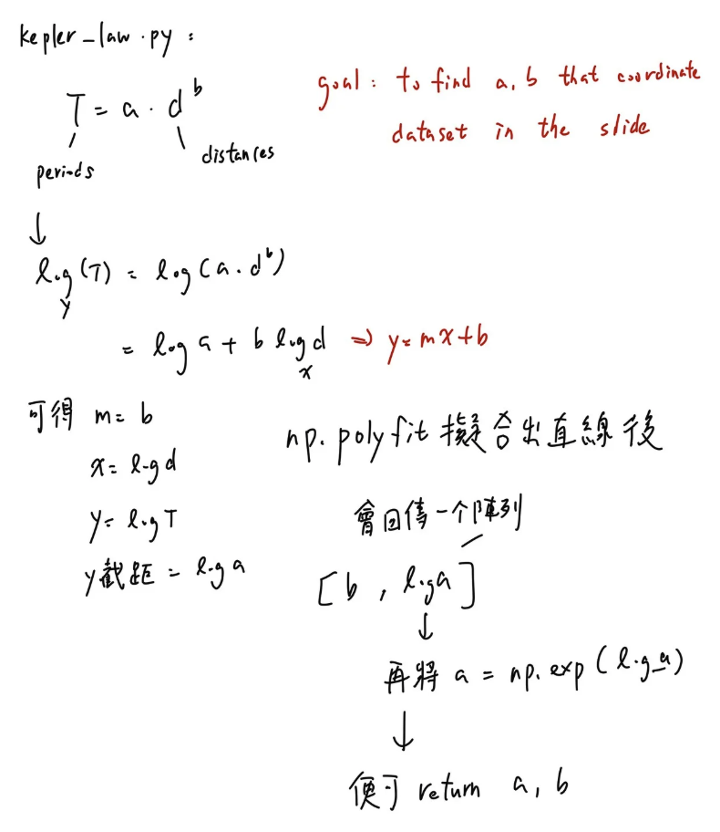
    </div>

### 補充：mse, diff差別

| | mse | diff |
| :--- | :--- | :--- |
| **目的** | 評估模型擬合品質 | 驗證 Kepler's Law |
| **定義** | 模型預測出的週期跟實際週期的均方差 | 兩個行星 $T^2/d^3$ 的絕對值差 |
| **比較對象** | 自己比較後有八個數值並取平均 | 兩個行星互相比較 |

---

# Work Division

| 學號/姓名 | 分配項目（寫） | 分配項目（檢查） |
| --- | --- | --- |
| 411485002 楊昕展 | 第一部分 q5,6,7,8<br>python安裝<br> | 第三部分Q1、Q2|
| 411485003 胡庭睿 | python, numpy, matplotlib的安裝<br>model for physics q2| 第一部分Q5~Q8 |
| 411485018 蘇星丞 |  第一部分Q1Q2Q3Q4 | 第二部分 |
| 411485042 黃柏崴 | 第二部分Q1~Q6| 第一部分Q1~Q4 |


# Challenges and Difficulties
 
### 姓名： 楊昕展
### 遇到的困難與挑戰：
1.  **心智圖製作**：在製作 Q8 的心智圖時，由於先前缺乏經驗，為了更好地連結教授講授的不同形式函式，花費了較長時間進行構思與製作。
2.  **Python 安裝教學**：雖然 Python 安裝看似簡單，但要教會完全沒接觸過程式的人卻步步維艱。需要設想初學者的視角，這使得撰寫安裝指南變得具挑戰性。

---
### 姓名： 胡庭睿
### 遇到的困難與挑戰：
1.  **程式碼的可讀性與執行門檻**：最大的挑戰在於如何讓完全沒有 Python 基礎的 Reviewer 也能順利理解並執行程式碼。
2.  **教學文件的撰寫**：需要預想初學者可能遇到的問題（如環境變數設定、套件安裝等），並將解決方案詳細寫入 README (或報告中)，以降低 Reviewer 的操作門檻。

---
### 姓名： 蘇星丞
### 遇到的困難與挑戰：
1.  **基礎觀念不穩**：在解題過程中發現自己對於微積分的基礎定義（Definition）存在漏洞，有時會忘記關鍵概念，即便會算題目但缺乏推論的理論基礎。
2.  **主動性不足**：此次僅負責較基礎且簡單的部分，意識到自己應更積極嘗試挑戰較難的題目。

---
### 姓名： 黃柏崴
### 遇到的困難與挑戰：
1.  **表達能力不足**：對於如何正確且詳細地描述一個數學概念或題目感到困難，不確定如何善用口語、圖表與公式來呈現。
2.  **程式工具的不熟悉**：對 Python 程式運作與安裝流程較為陌生，需要透過與組員討論學習才能解決相關問題。

---

# Meeting Records
(詳細會議記錄內容在Appendix A)
| 時間 | 工作項目 |
| :--- | :--- |
| 9/21(一) | 下課時小組加Line、Discard，回去創簡報討論工作分配 |
| 9/26(五)、9/27(六) 晚上討論(有點失敗) | 主要先做分配項目的，如果有問題一起解決 |
| 9/29(一)22:00~24:00 | 沒做同學有開始補 |
| 9/30(二)北大圖書館討論 | Basic concept的Q8(心智圖)<br>Alternative expression for functions的Q6的困難部分<br>python、numpy、matplotlib的困難部分 |
| 10/1(三)、10/2(四)系課下課討論 | 檢查分配 |
| 10/3(五) | 檢查 |
| 10/4(六) | 檢查、所有問題提出、解決，做工作分配、反省、最後排版 |
| 10/5(日) | 四人確認，提交 |

# Working Hours Records

| 組員姓名 | 工作時數 | 工作項目 | 工時高/低原因分析 (Bonus) |
| :--- | :--- | :--- | :--- |
| 楊昕展 | 約12小時 | 1. Basic concept Q5~Q8 (心智圖)<br>2. Python 安裝撰寫<br>3. Review 程式部分 | Q8 心智圖製作構思時間較長<br>Python 安裝教學需設想新手視角，<br>反覆修改步驟，因此耗時較高。 |
| 胡庭睿 | 約14小時 | 1. Python, NumPy, Matplotlib 安裝教學<br>2. Model for physics Q2 程式撰寫<br>3. Review 第一部分 Q5~Q8 | 程式部分從零建置並撰寫詳細 README，加上預想組員可能遇到的環境問題，為了確保可執行性花費了大量時間。 |
| 蘇星丞 | 約4小時 | 1. Basic concept Q1~Q4<br>2. Review 第二部分 | 此次負責較基礎的題目，解題過程順利，因此花費時間相對較短。意識到需更主動挑戰難題。 |
| 黃柏崴 | 約10小時 | 1. 第二部分 Q1~Q6<br>2. Review 第一部分 Q1~Q4 | 負責表達與描述部分，因自我要求高且需不斷與組員討論如何精確呈現數學概念，過程需反覆修飾。 |


# Reflection

### 學號：411485018
### 姓名：蘇星丞
### 心得：
我在這次的微積分報告中，做了基礎題的部分，我能感覺到自己雖然都幾乎會寫，但是我的基礎觀念有些地方都會有漏洞，像是定義我就會忘記，但是我知道定義那些是數學中最重要的一部分，因為它可以拿來推理後續的公式或理論之類的，所以我會加強這部分觀念的補強。我在這次的報告中做了比較少也比較簡單的事，下次我會督促自己積極一點，而且想寫寫看過比較難的題目

---
### 學號：411485003
### 姓名：胡庭睿
### 心得：
在這次的報告中，我負責了程式的部分，因為組員皆不熟悉程式加上是第一次作業的關係，我選擇了自己較熟悉的部分。考慮到要讓reviewer在零基礎的情況下理解，我盡量使用變數少的方案，讓reviewer可以不用遇到太多問題也能夠執行code，除此之外，我也將負責的報告部分內容寫得詳細，讓reviewer能夠在檢查的過程中學習並理解每個部分，以及它們之間的運作關係。在這次撰寫報告的過程中，為了能夠站在初學者的角度，我也問了組員許多他們遇到的困難，再加上回想我一開始學習python時可能遇到的常見問題，將它們都寫進README.md，讓組員在操作的時候更方便，希望之後我們熟悉彼此的默契後，工作流程可以更加順暢。

---
### 學號：411485002
### 姓名：楊昕展
### 心得：
我非常感謝微積分教授與助教辛苦出這次的報告作業，雖然時間佔據有點多，然而，我所收穫的不僅僅只有課堂上的數字，微積分於生活上的應用使的我對微積分有更好的連結，甚至程式是我們以後四年都必須接觸的環境，雖然是python，但簡單的語法讓我這初學者還是可以快速熟稔程式內涵。我寫的部分Basic concept的Q5到Q8和python的安裝，我認為Q8的心智圖是我在大學前沒有做過的，所以完成這部分花了較長時間，有助於我更好理解與連結教授上課獨立講授不同形式的函式；python的安裝也是我一項難題，看似操作簡單，但教導他人卻是步步捆足，所以我寫的每步驟看似多餘(最後有決定捨去一些)，其實是替那些真的完全沒接觸程式著想。最後，我也存心感謝這次組員們的合力與配合來完成這61頁的報告，胡同學的程式教導、蘇同學的報告分組的見解與黃同學的開群討論的迄始，我認為，有這三人與我組成的四人微積分小隊，以後任何微積分報告作業必定能勇於挑戰，直到成功。

---

### 學號：411485042
### 姓名：黃柏崴
### 心得：
這次的報告中，我負責了表達的部分，因為我的表達能力不夠優秀，在經過討論後，組員決定讓我負責第二部分以增強我的表達能力。
經過這次的磨練後，我明顯的意識到表達式需要經常磨練的，一段話要如何正確且詳細的描述出來是十分重要的。在其中我也漸漸學會如何善用口語、圖表、圖形及公式表示出題目的不同樣貌，他們互相搭配能使觀看者更好的理解主題。同時，我們也會互相討論我們有問題的題目，例如我對程式也比較不熟，藉此我可以更了解他的運作方式，也學會如何安裝程式、解決問題。

# Appendix

## Appendix A
### 9/21(一)
開會討論投票
<div style="display: flex; justify-content: center; gap: 20px; margin-top: 10px;">
  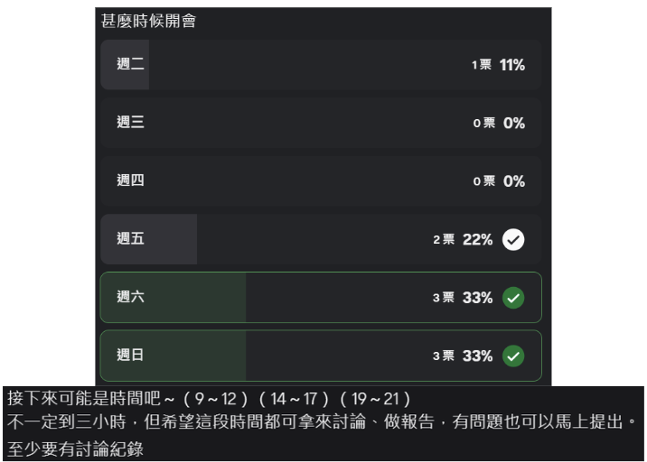
</div>
最後決定9/27(六)晚上

#### 工作分配
剛開始我們毫無頭緒，不過胡庭睿同學(會寫程式)就率先說我們第一次分組還不熟悉彼此，先由他來寫程式，由我們不會的檢查，他可以教導，後來事實也如此。(後面證明)

#### 報告格式
剛開始楊昕展同學開Canva的簡報(寬)，後來黃柏崴同學就提出改用文件格式(直)，所以我們就想到老師開學建議我們用的overleaf，但使用時就不能用中文，還要一些程式來排版，回到Canva文件形式，打算下次試試。

### 9/27(六)
雖然有約好晚上討論，不過組員臨時有事，結果討論有點失敗

### 9/29(一)解決
因為那週同學剛開學有活動和簡報形式的不確定，我們沒有及時溝通清楚，所以只有部分同學開始做，不過星期一都有開始補齊。

最後我們達成共識，統一用canva文件的形式，並且討論的形式由線下改為線上，先把自己的部分做完，並讓組員知道彼此的工作進度，互相監督
<div style="display: flex; justify-content: center; gap: 20px; margin-top: 10px;">
  
</div>

### 9/30(二) 13:30~16:00 圖書館、10/2(三)、10/3(四)
#### 困難討論與解決：

1.  **Basic Concept Q8 (心智圖)**
    *   這本來是分配給楊昕展同學，但他不太懂怎麼做。在圖書館時蘇星丞同學和黃柏崴同學給出建議，做類似樹狀圖樣，先做出草稿（做了三次，最後決定加入超越函數 transcendental），再用線上心智圖軟體解決。
    *   <div style="display: flex; justify-content: center; gap 20px;      margin-top: 10px;">
        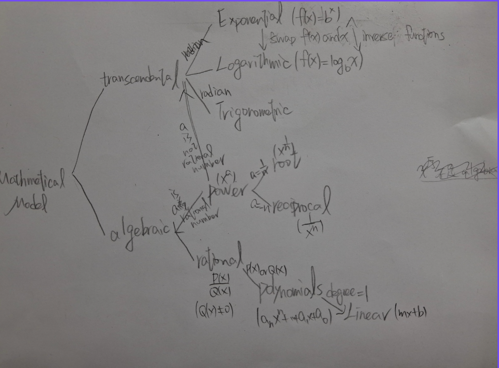
        </div>

2.  **Python 安裝**
    *   **楊昕展提問**：「我不太懂老師要我們只寫安裝python就好，還是包括下載編譯器，但是太了多。」
    *   **胡庭睿解答**：「教授應該是想要我們列出搭建環境的過程，那個我做好，但是challenge可能需要你幫忙想一下。」

3.  **方程式格式**
    *   我們想用方程式的格式，但複製 Google 文件或 Overleaf 的方程式也行不通，最後由胡庭睿同學爬文解決 (使用 Canva 方程式功能)。

4.  **第二部分 Q5 (圖形繪製)**
    *   **黃柏崴提問**：「我第二大題第五題圖形我不會用電腦畫圖形，他有pi還是我都代3.14算。」
    *   **楊昕展解答**：「你查數學繪圖，第一個。」(並提供截圖教學)

### 10/2(三)
*  約定好禮拜四前要把自己部分做完，然後禮拜五檢查，六日把最後的心得和分配等項目寫完

### 10/3(五)、10/4(六) 檢查、最終討論
#### 蘇星丞同學檢查：
*   **第二大題**：Q1 要寫他從冷凍的派烤到放涼以後；Q2 的 3 他是問值域不用寫定義域。

#### 楊昕展同學檢查：
*   對胡庭睿的提問：
    1.  Q1 好像沒有問題跟克服。
    2.  Q2 可以標出在做哪個投影片，方便老師看。
    3.  Q1 像像只要填資料就好了ㄟ。
    4.  第二題要report the figure(我不懂題目意思)和解釋有沒有呼應克普勒公式(沒看到)。
    5.  第三題，標籤名稱我覺得可改說法(圖片的標題...)Ober的O大寫。
    6.  看不太懂T_fit的解釋...，legend()是顯示plot吧?(我也不清楚)。
    7.  plt.savefig()老師沒有這個...
    8.  close也沒有。
    9.  想問Report the figure.是要做麼?
    10. plt.scatter要放嗎(不過要放我沒意見...)

#### Reviewer 評論：
在之前圖書館胡庭睿同學就有教我們程式（例如：現場下載 python、numpy），這讓我再寫下載 python 部分時可更快上手，我們有問題也可問他，我當時以為他做多了，結果是他想讓我們更好的檢查與學習。

### Appendix B
[作業網址](https://github.com/Tingruih/calculus-hw1)